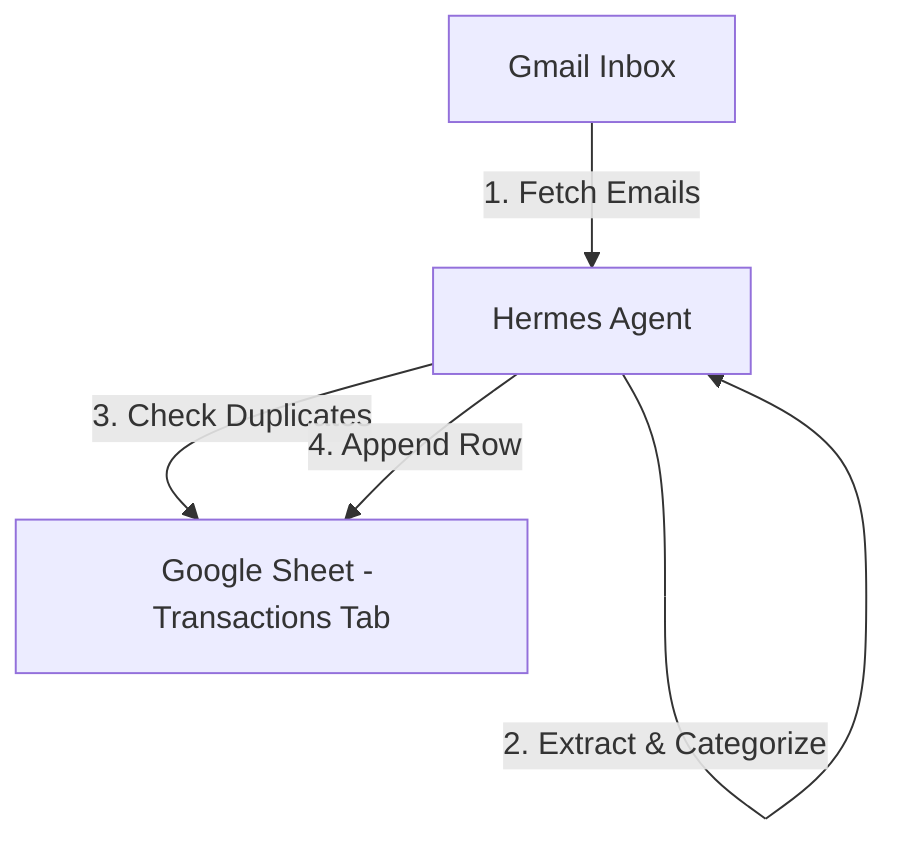

# Implementation Plan: Gmail-to-Sheets Spending Tracker Sync

This plan outlines the design and step-by-step implementation for an automated expense tracking system, matching your downloaded `system_architecture_loops_and_automation.md` document. The system will run as a daily background task on your remote VM, reading transaction emails (Grab, GoPay, Jago) from Gmail via Composio and logging them directly to a Google Sheet.

---

## Architecture Overview

- **Data Sources:** Gmail notifications from **Grab** (transportation/food), **GoPay** (subscriptions), and **Jago Bank** (electricity/utilities).
- **Storage:** Google Sheets (no local SQLite database is used). The spreadsheet serves as the single source of truth.
- **Schedule:** Run automatically at **5:30 PM WIB** daily (via the `Daily Spending Tracker` cron job on your VM).

---

## Spreadsheet Structure

The agent will create and maintain one Google Sheet named **"Spending Tracker"** (or use an existing one, hardcoding the Spreadsheet ID). It will contain the following tabs:

1. **`Transactions` (Write-only by Agent):**
   A raw log of all transactions. Columns:
   `Date | Source | Description | Amount (IDR) | Category | Gmail Message ID`
2. **`Monthly Summary` (Formula-driven only):**
   Auto-groups `Transactions` by month and category using Google Sheets formulas (e.g. `=QUERY` or `=SUMIFS`). The agent never writes directly to this tab, ensuring clean separation of data and visualization.

---

## Proposed Changes

We will implement this pipeline in four distinct phases:

### Phase 1: Sender & Format Discovery (Investigation phase)
We will run a discovery task on the VM to search Gmail for emails containing `Grab`, `GoPay`, and `Jago` over the last 60 days.
- **Goal:** Find the exact email sender addresses and transaction email formats to build a robust regex/filtering guide for the parser.

### Phase 2: Spreadsheet Setup
The agent will execute a setup step via the Google Sheets MCP tools:
1. Create a spreadsheet named **"Spending Tracker"** (if not already existing).
2. Configure the **`Transactions`** sheet headers.
3. Configure the **`Monthly Summary`** sheet with the dynamic rollup formulas.

### Phase 3: One-Time Backfill (June 1–30, 2026)
We will run a manual backfill task covering the first test batch:
1. Query Gmail for matching emails from **June 1 to June 30, 2026**.
2. Parse dates, merchants, descriptions, and amounts.
3. Categorize according to the guide:
   - Grab → Transport or Food (parsed from email content)
   - GoPay → Subscriptions
   - Jago Bank → Utilities (Electricity)
4. Verify deduplication by reading the `Transactions` tab to ensure no duplicate message IDs are added.
5. Send a final Telegram summary with a link to the spreadsheet to review the results.

### Phase 4: Daily Cron Synchronization
Update the existing daily cron job (`Daily Spending Tracker` at 5:30 PM WIB) to:
1. Scan the previous 24 hours of emails.
2. Filter by discovered sender addresses.
3. Append new entries to the `Transactions` sheet tab.
4. Send a Telegram notification listing the daily log.

---

## Verification Plan

### Automated Verification
- Verify the spreadsheet creation and backfill output formats.
- Verify deduplication checks successfully skip already logged `Gmail Message ID` cells.

### Manual Verification
- Review the `Transactions` log in Google Sheets.
- Verify that `Monthly Summary` aggregates the June data correctly.
